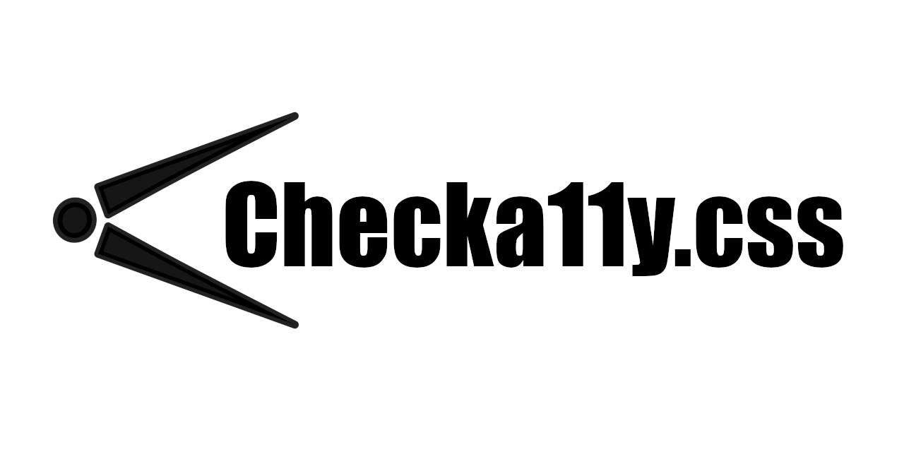

  

  

  

    

     

   
  

---

# Checka11y.css

**A CSS stylesheet to quickly highlight a11y concerns.**

_Lightweight_ &bull; _Modern_ &bull; _Accessibile_ &bull; _Customisable_ &bull; _Simple_

The first line of defence for testing accessibility.

Designed to quickly highlight some common accessibility errors and warnings that can be easily and quickly rectified.

Recommended before turning to automation tools and scanners such as Lighthouse on Chrome.

---

## Available as:

### Browser extension

Intended for use as a browser extension so you can toggle the Checka11y.css stylesheet on and off on any webpage.

[See project for more details on usage and installation](./browser-extension).

- [Firefox add-on](https://addons.mozilla.org/en-GB/firefox/addon/checka11y-css)
- [Chrome Web Store](https://chrome.google.com/webstore/detail/checka11ycss/npkoehgjmnffjdaelommnfjkflenbfaa)

### npm / Yarn / CDN

Intended for use as a dependency to be used in another project.

[See project for more details on usage and installation](./npm).

---

  [GitHub](https://github.com/jackdomleo7/Checka11y.css "View the GitHub repo and maybe give us a star") &bull; [npm](https://www.npmjs.com/package/checka11y-css "View Checka11y.css on npmjs.com") &bull; [yarn](https://yarnpkg.com/package/checka11y-css "View Checka11y.css on yarnpkg.com") &bull; [docs](https://checka11y.jackdomleo.dev "Read the official documentation") &bull; [CHANGELOG](https://github.com/jackdomleo7/Checka11y.css/releases "Read all the releases") &bull; [License](https://github.com/jackdomleo7/Checka11y.css#license "MIT License") &bull; [Chrome Web Store](https://chrome.google.com/webstore/detail/checka11ycss/npkoehgjmnffjdaelommnfjkflenbfaa) &bull; [Firefox add-on](https://addons.mozilla.org/en-GB/firefox/addon/checka11y-css)

