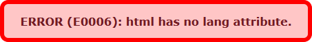

<div align="center">

  

  <a href="https://www.buymeacoffee.com/jackdomleo7" target="_blank"></a> <a href="https://www.producthunt.com/posts/checka11y-css?utm_source=badge-featured&utm_medium=badge&utm_souce=badge-checka11y-css" target="_blank"></a>

   [](https://github.com/jackdomleo7/Checka11y.css/blob/master/LICENSE) [](https://github.com/jackdomleo7/Checka11y.css/blob/master/checka11y.css)

  [](https://github.com/jackdomleo7/Checka11y.css/stargazers) [](https://github.com/jackdomleo7/Checka11y.css/releases) [](https://www.npmjs.com/package/checka11y-css) 

  [](https://chrome.google.com/webstore/detail/checka11ycss/npkoehgjmnffjdaelommnfjkflenbfaa) [](https://addons.mozilla.org/en-GB/firefox/addon/checka11y-css)
  
  
</div>

---

# Checka11y.css

**A CSS stylesheet to quickly highlight a11y concerns.**

_Lightweight_ &bull; _Modern_ &bull; _Accessibile_ &bull; _Customisable_ &bull; _Simple_

The first line of defence for testing accessibility.

Designed to quickly highlight some common accessibility errors and warnings that can be easily and quickly rectified.

Recommended before turning to automation tools and scanners such as Lighthouse on Chrome.

Remember not to push this to production!

A great tool for:

- Websites and web applications to begin improving their accessibility.
- Developers and testers/QA to learn more about accessibility and creating accessible websites and applications.

---

## Features

Our features are always checked against the W3C accessibility guidelines.

A list of some common a11y concerns Checka11y.css will check for and highlight :

- Check for invalid HTML elements nested inside of `<a>` and `<button>`
- Check for missing `alt` attributes on images
- Check for media that is set to `autoplay`
- Check `<li>` is the **only** direct child of `<ol>` and `<ul>`
- Check for programmable-only `tabindex` attributes on invalid HTML elements

See a full list of features [here](./features.md).

Other features:

- Clear a11y errors and warnings with informative messages and error codes (see [codes.md](./codes.md) for more details on the specific errors & warnings)
- Options to import via CDN, npm or yarn
- Customise the error and warning colors
- No dependencies
- Also available on the [Chrome Web Store](https://chrome.google.com/webstore/detail/checka11ycss/npkoehgjmnffjdaelommnfjkflenbfaa) and as a [Firefox add-on](https://addons.mozilla.org/en-GB/firefox/addon/checka11y-css) (click [here](https://github.com/jackdomleo7/Checka11y.css-browser-extension) to view GitHub project)

---

## Error/Warning Codes

When using Checka11y.css, you will notice some codes prefixed with either "E" or "W". E.g.

<div align="center">
  
</div>

If you wanted more details on this error and how to resolve it, you can reference the [codes.md](./codes.md) file and find the code "E0006".

---

## Usage

### CDN

In the below CDN links:
- Replace `:version` with a version [listed here](https://www.npmjs.com/package/checka11y-css?activeTab=versions) (latest version is always recommended). If you always want to get the latest stylesheet, remove `@:version` completely (Not recommended).
- Replace `:stylesheet` with one of the listed stylesheets below:
  - `checka11y.css` <small>(errors & warnings, recommended)</small>
  - `checka11y-errors.css` <small>(errors **only**)</small>
  - `checka11y-warnings.css` <small>(errors **only**)</small>

```html
<!-- HTML -->
<link rel="stylesheet" href="https://cdn.jsdelivr.net/npm/checka11y-css@:version/:stylesheet" />
```

```css
/* CSS */
@import url('https://cdn.jsdelivr.net/npm/checka11y-css@:version/:stylesheet');
```

### Package manager (npm or yarn)

It is best practice to install Checka11y.css as a dev dependency rather than a dependency and ensure you only use it in your local/developer environment (do not push this stylesheet to your production environment). You can install `checka11y-css` via **npm** or **yarn**.

_First_ install via **npm**
```
npm install checka11y-css --save-dev
```

_Or_ install via **yarn**
```
yarn add --dev checka11y-css
```

_Then_ import into your JavaScript
```js
import 'checka11y-css';
```

_Or_ import the SCSS or CSS into your Sass/SCSS
In the below imports, replace `:file` with one of the options below:
- Errors & warnings <small>(recommended)</small>
  - `src/checka11y` <small>(.scss file)</small>
  - `checka11y.css` <small>(.css file)</small>
- `src/errors/checka11y-errors` <small>(errors **only**)</small>
- `src/warnings/checka11y-warnings` <small>(warnings **only**)</small>
```scss
/* Webpack */
@import '~checka11y-css/:file';

/* Non-webpack */
@import 'path/to/node_modules/checka11y-css/:file';
```

### Using Angular?

👉 [Go to ngx-checka11y](https://github.com/AlaaEl-DinAhmed/ngx-checka11y)

---

## Why is accessibility important?

Accessibility is important to ensure your website or web application is accessible to as many users and types of users you can cater for.

Often, we can improve the accessibility on our websites and web applications by focusing on the obvious first - these are small quick wins that are easy to implement or rectify and may not require a lot of time investment.

Checka11y.css will instantly highlight as many HTML validity and HTML semantic errors and warnings as we can, to help you to improve your website or web application.

[Click here to read more about web accessibility.](https://www.w3.org/WAI/fundamentals/accessibility-intro)

---

## License

Type - **MIT**

[Read license](https://github.com/jackdomleo7/Checka11y.css/blob/master/LICENSE)

You have the right to use this library in **any** project FREE of charge for personal and commercial use.

Commercial use should consider a small donation on [Buy Me a Coffee](https://www.buymeacoffee.com/jackdomleo7).

You **do not** have the right to resell, sublicense or redistribute (even for free) this library.

Checka11y.css is licensed under MIT. As a minimum, you are required to KEEP AND NOT REMOVE the following code at the beginning of your downloaded/installed Checka11y.css CSS, where `:version` is replaced with the version number you are using:

```css
/*! Checka11y.css v:version | MIT License | github.com/jackdomleo7/Checka11y.css */
```

---

## Contributing

1. Read [CONTRIBUTING](./CONTRIBUTING.md) guidelines
2. `git clone https://github.com/jackdomleo7/Checka11y.css.git` or fork the repo
3. `cd Checka11y.css`
4. `npm i`
5. Edit `src/**/*.scss` and run `npm run build` in the root of the project to regenerate the CSS found at `/checka11y.css` (DO NOT edit this file directly).
6. To add error/warning styles and messages to your features, `@extend` one of the placeholders and `@include contentMessage()` from `src/_base.scss`.
7. Add tests to your features in cypress folder (edit the element file or create a new one if needed)
8. Run tests: `npm run cypress:open` or `npm run cypress:run` (headless)
  - You can also run tests for a specific tag/attribute by doing `npm run cypress:run -- --spec cypress/integration/{file-to-test}`
9. Add the feature to the [features.md](./features.md) & [codes.md](./codes.md) with a new error or warning code

---

<div align="center">

  [GitHub](https://github.com/jackdomleo7/Checka11y.css "View the GitHub repo and maybe give us a star") &bull; [npm](https://www.npmjs.com/package/checka11y-css "View Checka11y.css on npmjs.com") &bull; [yarn](https://yarnpkg.com/package/checka11y-css "View Checka11y.css on yarnpkg.com") &bull; [docs](https://checka11y.jackdomleo.dev "Read the official documentation") &bull; [CHANGELOG](https://github.com/jackdomleo7/Checka11y.css/releases "Read all the releases") &bull; [License](https://github.com/jackdomleo7/Checka11y.css#license "MIT License") &bull; [Chrome Web Store](https://chrome.google.com/webstore/detail/checka11ycss/npkoehgjmnffjdaelommnfjkflenbfaa) &bull; [Firefox add-on](https://addons.mozilla.org/en-GB/firefox/addon/checka11y-css)

</div>
